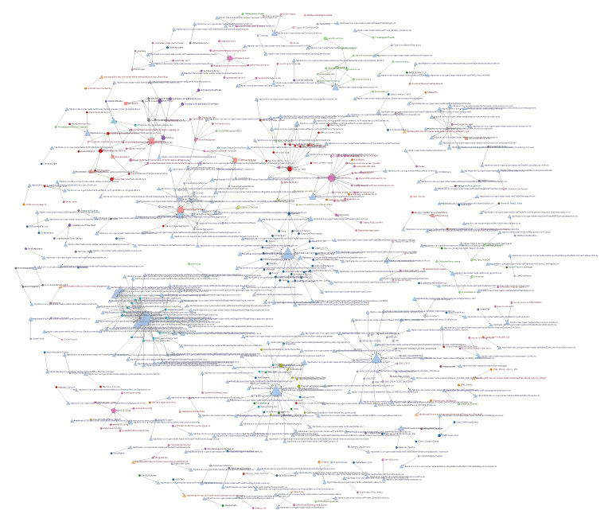

go-dependency-force-layout
==========================
This is a tool to visualise the web of dependencies present in a large configuration of [ThoughtWorks’ Go system for continuous delivery](http://www.thoughtworks.com/products/go-continuous-delivery).

 Circles represent pipelines,  squares represent pipeline templates, and  triangles represent source code repositories. Arrows represent dependencies and the size of each shape grows with more incoming dependencies. Pipelines in the same groups are coloured similarly.

## More

Read more (including instructions to create your own) on the project website, or take a look at [an example built from our pipeline definitions.](http://mrmanc.github.io/go-dependency-force-layout/pipeline-dependencies.html?u=http://mrmanc.github.io/go-dependency-force-layout/examples/27012014.json)

